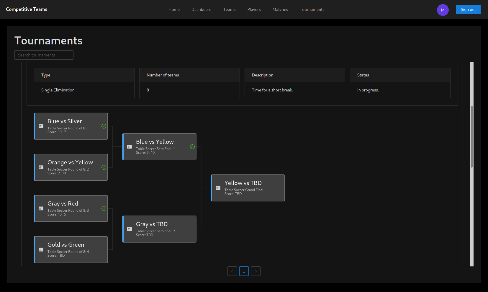
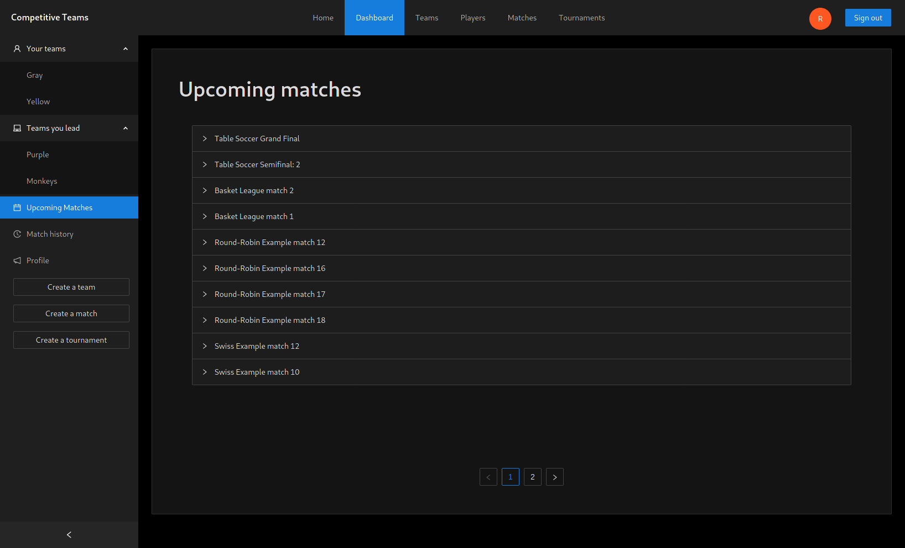

# Competitive Teams 

https://competitive-teams.herokuapp.com

## Description

The goal of this project was to create a web application that lets users create/join teams and helps them host tournaments or matches between those teams. It allows for easy tournament matchup generation in round-robin, swiss, and single-elimination style tournaments while providing a convenient way to keep track of their results.




## Technologies

Main technologies used in the development of this project:

- Frontend: React, Ant Design, G6, React Router, React Query, Axios, Firebase
- Backend: FastAPI, SQLAlchemy, Pydantic, PostgreSQL
- Deployment: Travis CI, Docker, Heroku

## Running the development servers

We've provided a simple bash script for starting and combining the outputs of both servers. To run the servers locally:


* Create and configure a new Google Firebase project.
* Generate a private key JSON file and save it as `backend/.env.local/saf.json`.
* Export the environmental variables from your Google Firebase project and place them in the `frontend/.env.local` file:
    ```bash
    REACT_APP_FIREBASE_APIKEY="<key>"
    REACT_APP_FIREBASE_AUTHDOMAIN="<domain>"
    REACT_APP_FIREBASE_PROJECTID="<id>"
    REACT_APP_FIREBASE_STORAGEBUCKET="<bucket>"
    REACT_APP_FIREBASE_MESSAGINGSENDERID="<id>"
    REACT_APP_FIREBASE_APPID="<id>"
    REACT_APP_FIREBASE_MEASUREMENTID="<id>"
    ```
* Optional - set up your own PostgreSQL server (instead of using the DB container included in the `run-dev.sh` script):
    * Configure and start your PostgreSQL server.
    * Comment out the PostgreSQL docker container setup in `run-dev.sh`
    * Replace the `DATABASE_URL` variable inside the `run-dev.sh` script with your PostgreSQL database URL.
* Install frontend packages:
    ```bash
    cd frontend
    npm install
    cd ..
    ```
* Install backend packages and setup a venv:
    ```bash
    cd backend
    python -m venv env
    source ./env/bin/activate
    pip install -r requirements.txt
    deactivate
    cd ..
    ```
* Start the `run-dev.sh` script.
